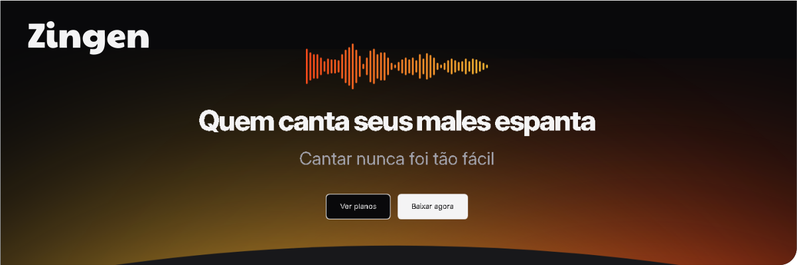

# 

# Zingen - Landing Page


## Descrição
Zingen é uma landing page responsiva desenvolvida para promover um aplicativo de karaokê. Este projeto foi criado como parte da formação Full-stack da plataforma _Rocketseat_ e utiliza HTML5 e CSS3 com práticas modernas de desenvolvimento web.
- **Design criado por:** Ilana Mallak
- **Tipo de atividade:** Compulsória. Desenvolvimento completo baseado no design do [Figma](https://www.figma.com/community/file/1371886246180677672).

## Tabela de Conteúdos
- [Status do Projeto](#status-do-projeto)
- [Features](#features)
- [Como Executar o Projeto](#como-executar-o-projeto)
- [Tecnologias Utilizadas](#tecnologias-utilizadas)
- [Autor](#autor)
- [Licença](#licença)

## Status do Projeto
✅ Concluído. A landing page foi finalizada e está pronta para a sua avaliação! 🎉

⭐ Se curtir, no canto superior direito, deixe uma estrelinha pra gente. 😉 

## Features
- **Interface Responsiva**: Adapta-se a diferentes dispositivos (mobile, tablet, desktop).
- **Design Modular**: Arquivos CSS separados por componentes, facilitando personalizações futuras.
- **SEO Friendly**: Utilização de boas práticas para otimização de motores de busca.

## Como Executar o Projeto
### Acessar Online

Você pode visualizar o projeto agora clicando neste link: [Zingen Landing Page](https://ludovicomonjardim.github.io/Exercicio_Projeto_Zingen_Responsivo/).

### Executar Localmente

1. Clone este repositório:
   ```bash
   git clone https://github.com/seu-usuario/zingen-landing-page.git
   ```
2. Navegue até a pasta do projeto:
   ```bash
   cd Zingen (por exemplo)
   ```
3. Abra o arquivo `index.html` no navegador de sua preferência.

## Tecnologias Utilizadas
- **HTML5**: Estruturação do conteúdo.
- **CSS3**: Estilização modular com arquivos separados por componente.
- **Boas Práticas de Responsividade**: Media queries e layout flexível.

## Autor
Feito com ❤️ por **Ludovico Monjardim**. 


Entre em contato comigo!

- **LinkedIn**: [Ludovico Monjardim](https://www.linkedin.com/in/ludovicomonjardim/)
- **Email**: ludovico.monjardim.pro@gmail.com

## Licença
Este projeto está licenciado sob a [MIT License](LICENSE).